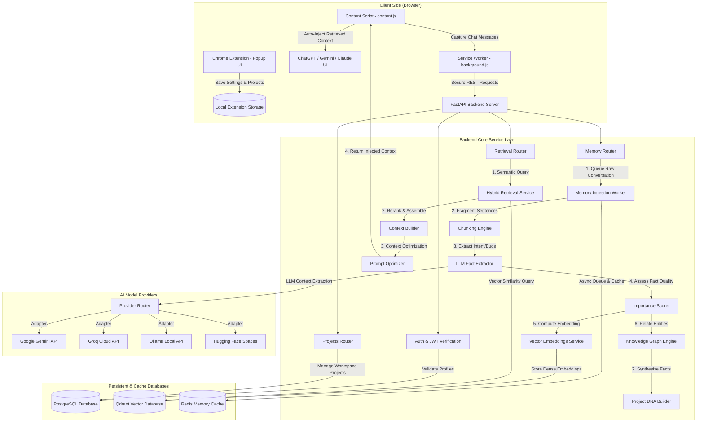

# 🧠 Mnemosyne — AI Memory Platform

> **Persistent memory layer for Large Language Models.**
>
> Mnemosyne remembers your projects so you never have to rebuild context again.

[](https://github.com/your-org/mnemosyne/actions)
[](https://www.python.org/downloads/)
[](https://fastapi.tiangolo.com/)
[](LICENSE)

---

## 📖 Overview

### The What: What is Mnemosyne?
Mnemosyne is a persistent memory and knowledge-synthesis layer designed for Large Language Models. By connecting a browser extension directly to a FastAPI backend and structured vector stores, it ensures that your AI assistant retains context, specifications, and project choices across separate conversations.

### The Why: The Real-World Problem It Solves
Current LLM assistants (ChatGPT, Claude, Gemini, etc.) are **stateless**. The moment you close a tab or click "New Chat", all project history, resolved bugs, coding standards, database schemas, and architectural choices are completely forgotten. 

When you start a new conversation, you are hit with high cognitive load and manual overhead:
1. You have to explain your project goals and architecture again.
2. You must copy-paste dependency files, configurations, and API keys.
3. You have to re-verify resolved bugs so the model doesn't re-propose broken solutions.

**Mnemosyne resolves this by acting as your project's digital hippocampus.** It continuously observes developer chats, distills unstructured conversation threads into clear facts, code intents, decisions, and bugs, and stores them in a dense vector index. The next time you start a new chat, the extension queries the vector index for relevant past context and automatically injects it, ensuring the AI is instantly aligned.

---

## 🏗️ Architecture

How the client extension, memory ingestion flow, structured extraction pipelines, and storage engines cooperate:



---

## 🛠️ Chrome Web Store Publishing Status

> [!NOTE]
> **Why this extension is loaded locally:**
> Mnemosyne is fully functional and designed to run locally. It has not been published to the public Chrome Web Store because of upfront store registration fees and ongoing developer verification costs. To run the extension, load the `extension/` directory directly into Chrome using **Developer mode** ("Load unpacked") as outlined in the Quick Start below.

---

## 🚀 Quick Start

### Prerequisites

- Docker & Docker Compose
- Python 3.12+ (for local dev)

### 1. Clone the repository

```bash
git clone https://github.com/your-org/mnemosyne.git
cd mnemosyne
```

### 2. Configure environment

```bash
cd backend
cp .env.example .env
# Edit .env and set at minimum:
#   SECRET_KEY=<a long random string>
#   GROQ_API_KEY=<your Groq key>   (or GEMINI_API_KEY / leave blank for local)
```

### 3. Start all services

```bash
docker compose up -d
```

This starts:
| Service | URL |
|---------|-----|
| Mnemosyne API | http://localhost:8000 |
| Swagger Docs | http://localhost:8000/docs |
| PostgreSQL | localhost:5432 |
| Redis | localhost:6379 |
| Qdrant UI | http://localhost:6333/dashboard |

### 4. Run database migrations

```bash
docker compose exec api alembic -c alembic.ini upgrade head
```

### 5. Load the Chrome extension

1. Open Chrome → `chrome://extensions`
2. Enable **Developer mode** (top-right toggle)
3. Click **Load unpacked** → select `mnemosyne/extension/`
4. Click the 🧠 icon in your toolbar
5. Enter your API URL (`http://localhost:8000/api/v1`) and sign in

---

## 📡 API Reference

Full interactive docs available at **`/docs`** (development mode).

### Key endpoints

| Method | Path | Description |
|--------|------|-------------|
| `POST` | `/api/v1/auth/register` | Create an account |
| `POST` | `/api/v1/auth/login` | Obtain a JWT token |
| `GET`  | `/api/v1/auth/me` | Current user profile |
| `POST` | `/api/v1/projects` | Create a project |
| `GET`  | `/api/v1/projects` | List your projects |
| `POST` | `/api/v1/memory/ingest` | Process a conversation |
| `POST` | `/api/v1/retrieval` | Semantic context retrieval |
| `GET`  | `/api/v1/health/live` | Liveness check |
| `GET`  | `/api/v1/health/ready` | Readiness check |

---

## 🔧 Development

### Install dependencies

```bash
cd backend
python -m venv .venv
source .venv/bin/activate      # Windows: .venv\Scripts\activate
pip install -r requirements.txt
```

### Run locally (without Docker)

Ensure PostgreSQL, Redis, and Qdrant are running (or use `docker compose up postgres redis qdrant -d`), then:

```bash
uvicorn main:app --host 0.0.0.0 --port 8000 --reload
```

### Run tests

```bash
pytest                                 # all unit tests
pytest -m "not integration"            # skip integration tests
pytest --cov=. --cov-report=term       # with coverage
```

### Lint & format

```bash
ruff check .
ruff format .
```

---

## 🧪 Provider Configuration

Set API keys in `.env`:

```env
GROQ_API_KEY=gsk_...          # https://console.groq.com
GEMINI_API_KEY=AIza...        # https://ai.google.dev
# OpenRouter, Ollama, HuggingFace also supported
```

Configure providers via the API (`/api/v1/providers`) or use the `local` provider (no API key required — uses deterministic hashing embeddings for development).

---

## 📁 Project Structure

```
mnemosyne/
├── backend/
│   ├── api/              # FastAPI routers (v1/)
│   ├── core/             # Config, security, auth, logger, lifespan
│   ├── database/         # SQLAlchemy base, session, migrations
│   ├── memory_engine/    # Chunking, extraction, embeddings, retrieval, graph, DNA
│   ├── models/           # SQLAlchemy ORM models
│   ├── providers/        # AI provider adapters (Groq, Gemini, Ollama, etc.)
│   ├── repositories/     # Data access layer
│   ├── schemas/          # Pydantic request/response models
│   ├── services/         # Business logic layer
│   ├── tests/            # Unit and integration tests
│   ├── workers/          # Background task functions
│   ├── main.py           # FastAPI app entry point
│   ├── Dockerfile        # Multi-stage production image
│   ├── docker-compose.yml
│   └── requirements.txt
│
├── extension/            # Chrome Extension (Manifest V3)
│   ├── manifest.json
│   ├── background.js     # Service worker
│   ├── content.js        # Page observer & injector
│   ├── popup.html
│   ├── popup.js
│   └── styles.css
│
├── .github/
│   └── workflows/ci.yml  # GitHub Actions CI/CD
│
└── README.md
```

---

## 🤝 Contributing

1. Fork the repository
2. Create a feature branch (`git checkout -b feature/my-feature`)
3. Commit with clear messages
4. Ensure tests pass (`pytest`)
5. Open a Pull Request

---

## 📄 License

MIT — see [LICENSE](LICENSE).

---

*Mnemosyne is named after the Greek goddess of memory and the mother of the Muses.*
